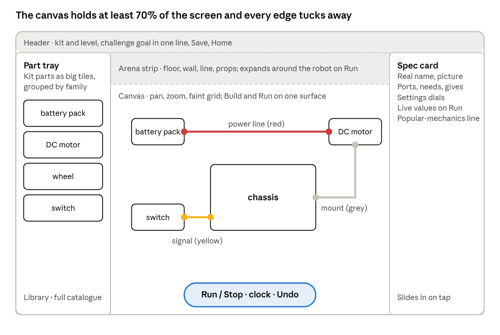

# Servo — Product & Design Brief

As of 2026-09-29 · Drew Douglas · Source of truth: https://claude.ai/code/artifact/08cdf597-8cae-4de4-9927-1172642f975b (this file is an export; refresh it when the doc changes)

# Part A — Product Brief

## 1. Vision and reframe

Servo is a digital robotics kit: a child picks real parts, wires them together on a big canvas, presses Run, and watches the robot move, stall, spin or fall over. The learning lives in the parts — what each one is, what it needs, what it gives out, and what goes wrong when it is connected badly.

The earlier draft wrapped the app around a story loop (Sense → Think → Act) and three guided missions. This brief moves that to the background. Parts, connections and configuration are the organising idea; missions and story become optional layers on top of a sandbox that is complete on its own.

| Area | Earlier draft | This brief |
| --- | --- | --- |
| Organising idea | Sense → Think → Act as the frame for everything | Parts as pieces: identity, ports, needs, behaviour. Sense → Think → Act becomes one lesson lens at Level 3 |
| Primary mode | Three guided missions, then sandbox | Sandbox first; kits and challenges layered on it |
| Interaction | Tap-to-place, phone-first | Big build canvas, wire-by-drag, tablet and desktop first; tap-to-place kept for small screens |
| Learning target | Understand that parts connect | A knowledge ladder: name → connect → configure → diagnose → design, aimed at real robotics skills |
| Failure states | Primary teaching device | Kept, and made physical: an underpowered motor stalls, an unsignalled servo stays still, a top-heavy chassis tips |
| Terminology | Real component names | Kept without exception |
| Parts roster | \~60 parts in eleven families | Kept as the catalogue; each part gains a spec sheet, ports and a simulated behaviour |
| Audience | Ages 6–8 | 6–8 is the entry tier; the ladder runs to about 12 so skills can build toward real kits |

One-line statement: **Servo is a sandbox of robot parts where children wire real components together and see what happens.**

Reading of the feedback to confirm: the earlier draft leaned on character and story; this one leans on components. If the intent was different, the reframe row above is the one to change.

## 2. Learners, levels and outcomes

Servo teaches five skills in order, and every level, part and challenge maps to one of them: **Name** a part, **Connect** it correctly, **Configure** it (values, ports, timing), **Diagnose** why a build misbehaves, and **Design** a robot for a job. The same five verbs are how a real robotics technician or engineer works, so the ladder points at real kits, not at the app.

| Level | Age band | Skill focus | The child can… | Real-world analogue |
| --- | --- | --- | --- | --- |
| 1 · Parts | 6–7 | Name | Pick out a battery, motor, wheel, switch and sensor; say what each one does; connect a power line to make one thing move | Sorting a hobby kit; naming parts on a toy teardown |
| 2 · Circuits | 7–8 | Connect | Build a complete power loop; add a switch; distinguish power lines from signal lines; explain why a loose wire stops everything | First breadboard circuit; Snap Circuits |
| 3 · Control | 8–9 | Configure | Add a brain (microcontroller); set a motor speed and a servo angle; read a sensor value; run a Sense → Think → Act rule | micro:bit or LEGO Spike basics |
| 4 · Systems | 9–11 | Diagnose | Trace a fault through power, signal and mechanics; read a spec sheet; match motor torque to load; balance a chassis | Debugging an Arduino rover; FIRST LEGO League |
| 5 · Design | 11–12+ | Design | Start from a job ("cross this gap", "sort these balls"), choose parts on specs, build, test, iterate, and document the build | Junior maker projects; VEX IQ; a first real Arduino kit |

Age bands are guides, not gates. A level opens when its skill check is passed, so an 8-year-old who flies can reach Level 4 and a 6-year-old is never locked out of the sandbox.

Outcomes per level are written as observable actions in the sandbox ("wires a motor through a switch to a battery and it runs"), never as quiz scores. Each level closes with an **unscripted build**: a job and a kit, no steps, judged by whether the robot does the job.

Open question: the earlier draft was 6–8 only. Extending the ladder to about 12 changes scope, art, reading load and the parent/teacher layer. The rest of this brief assumes the extended ladder with Levels 1–2 as the launch scope.

## 3. Curriculum domains

Five domains cover "the whole shebang", and every part in the catalogue belongs to one of them. A domain is taught through its parts, not through lessons about it: the child meets the idea of torque by watching a small motor fail to lift a heavy arm.

| Domain | Core ideas | Parts that carry it | First appears | Real skill it points at |
| --- | --- | --- | --- | --- |
| Mechanics | Force, friction, leverage, gears and ratios, balance and centre of mass, wheels vs tracks vs legs, linkages | Drivetrain, Structure & Ride, End Effectors | Level 1 (wheels turn), deepens Level 4 (gear ratios, balance) | Choosing and assembling a chassis, gearbox and gripper |
| Robotic system components | What a robot is made of: power, brain, sensors, actuators, output, comms, connectors; every part has inputs, outputs and a job | All eleven families | Level 1 | Reading a kit's parts list and a part's spec sheet |
| Electronics and power | Circuit loop, voltage and current in plain terms, batteries and their limits, switches, polarity, short circuits, motor drivers, why a brain cannot power a motor directly | Power, Connection, Actuators, Output | Level 2 | Wiring a breadboard or a real kit safely |
| Sensing and feedback loops | Sensors turn the world into numbers; a loop compares a reading to a target and acts; open vs closed loop; the Sense → Think → Act cycle; latency and noise | Sense, Brain, Actuators | Level 3 | Line following, obstacle avoidance, a servo holding position |
| Programs and computing | The brain runs a program: rules, conditions, repeats, timing, variables; block → text progression; where the program lives and how it is loaded | Brain, Comms | Level 3, text view at Level 5 | Programming a micro:bit, Arduino or Raspberry Pi |

Each domain also carries a short **popular mechanics** thread — where this shows up in the real world (a car's differential, a lift's counterweight, a washing machine's sensor) — delivered as one card per part, never as a lecture.

The eleven part families from the earlier draft stay as the catalogue's structure: Power, Brain, Sense, Actuators, Drivetrain, Structure & Ride, Output, Comms, Connection, End Effectors, plus one family still to name (the earlier list gave ten names for eleven families). Connection types also stay: power lines (red), signal lines (yellow) and mechanical linkages (grey).

What is deliberately out of scope: chemistry of batteries, transistor physics, and any maths beyond comparing and ordering numbers before Level 4.

## 4. The core experience: the sandbox

The whole product is one loop the child can run in under a minute: **pick parts → place them on the canvas → wire them → press Run → watch what happens → fix or change something → Run again.** Everything else (kits, challenges, the parts library, progress) feeds into or reads out of this loop.

**The canvas.** One large, zoomable build surface with a robot chassis at its centre. Parts sit on or around the chassis; wires are drawn between ports. The canvas has two states: **Build** (parts and wires are editable, the robot is frozen) and **Run** (wires lock, the simulation plays, values animate along the wires). A single big Run/Stop control switches between them.

**Digital kits.** A kit is a curated bag of parts for one level or job, like the box a real kit comes in: "Rolling Start" (battery, switch, 2 motors, 2 wheels, caster, frame), "Line Runner" (adds a microcontroller, 2 line sensors, motor driver). Kits keep the tray small for young builders. The full \~60-part catalogue is browsable separately in the **Parts Library** and any part can be pulled into a sandbox build from Level 3 up.

**Wiring.** Every part shows its ports as coloured sockets: red for power, yellow for signal, grey for mechanical. A wire is drawn from one port to another. A wire only lands on a port of the same colour, and the socket glows when the wire is close. Wrong-but-legal connections (a motor straight off a brain's signal pin) are allowed, because their failure is the lesson.

**Bring-to-life.** Pressing Run simulates the build. Correct builds move: wheels spin, servos sweep, LEDs light, buzzers sound, sensors show live numbers. Faulty builds fail in the way the real part would: a motor with no return path does nothing, a motor on a weak battery turns slowly and the battery icon drains fast, a servo with power but no signal sits still and hums. Failure is never a red X; it is behaviour to look at.

**Inspecting a part.** Tapping a part opens its spec card: what it is, its real name, its ports, what it needs, what it gives, its adjustable settings, and one popular-mechanics line. In Run mode the same card shows live values (volts in, speed out, sensor reading).

**Configuring a part.** From Level 3, parts have settings: motor speed and direction, servo angle, sensor threshold, LED colour, timer length. Settings are dials and sliders on the spec card; from Level 3 they can also be driven by rules in the brain.

**Saving and sharing.** Every build is saved as a **blueprint** (the parts, positions, wires and settings). Blueprints can be reopened, duplicated, and later exported as a parts list so a family can buy the real kit and rebuild it.

**Fun, deliberately.** The joy is in the robot doing something. Servo invests in physical feedback (wheels squeal on a fast start, a tipped robot's wheels keep spinning in the air), a test arena with props to push and bump, and "what if" prompts ("what happens with one wheel bigger than the other?"). No points, coins or streaks.

## 5. Progression and levels

Progress in Servo is measured by what the child can build, so the unit of progression is a **challenge**, not a lesson. Each level holds a kit, a set of challenges and one unscripted build; passing the unscripted build opens the next level and its parts.

| Element | What it is | How many per level | Example (Level 2 · Circuits) |
| --- | --- | --- | --- |
| Kit | The parts the level unlocks; always available in the sandbox afterwards | 1 | Battery pack, switch, 2 DC motors, motor driver, 2 wheels, caster, LED, buzzer |
| Part introduction | A 30-second first meeting: the part appears, the child wires it into a working build, the spec card opens | 1 per new part | "Meet the switch": put it in the power line, press it, the motor stops and starts |
| Guided challenge | A job with a hint ladder: silent → highlight the port → show the wire → do it for me | 4–6 | "Make the robot drive forward and light the LED at the same time" |
| Breakdown | A pre-built robot that misbehaves; the child finds and fixes the fault | 2–3 | One motor wired backwards so the robot spins on the spot |
| What-if | A working build and one thing to change, with no right answer | 2–3 | Swap the 2-cell battery for a 1-cell battery and watch the speed |
| Unscripted build | A job and the kit, no steps; passes when the robot does the job in the arena | 1 | "Cross the arena and stop at the wall" |

**Hint ladder, not lives.** A challenge can never be failed. Hints step in only when asked or after two Runs that miss the goal, and they always point at a part or port rather than saying the answer aloud first.

**Skill check without a test.** The unscripted build is the assessment. The app records which parts were used, how many Runs it took, which faults appeared and how they were fixed. That record drives the parent/teacher view (Section 7), not a score shown to the child.

**Sandbox is always open.** The sandbox holds everything unlocked so far plus, from Level 3, the whole Parts Library. Challenges are the path; the sandbox is the destination.

**Mastery loops back.** A part met at Level 1 (the DC motor) returns at every level with more of its spec card readable: at Level 1 it spins, at Level 2 it has polarity, at Level 3 it has a speed setting, at Level 4 it has a stall torque and current draw, at Level 5 it is chosen from three motors by spec.

Launch scope: Levels 1 and 2 complete (about 15 parts, 2 kits, 15–20 challenges), Level 3 designed, Levels 4–5 outlined.

## 6. Technical architecture

Servo is a **parts-and-ports simulation**: every part is data, every wire joins two typed ports, and a small simulation engine steps the whole graph forward in time. Nothing about a part's behaviour is hard-coded into the canvas, so adding a part is adding a record, not writing a feature. This is what makes a 60-part catalogue affordable.

**Parts schema.** One record per part type, authored as content, with these fields:

| Field | Purpose | Example (DC motor) |
| --- | --- | --- |
| Identity | Real name, family, domain, level introduced, art asset key (swap registry) | "DC motor", Actuators, Mechanics/Electronics, Level 1 |
| Ports | Named, typed sockets: power in/out, signal in/out, mechanical mount/drive; each with a direction and a rating | power+ , power− (3–6 V), drive shaft (mechanical out) |
| Needs | What must be true for it to work | Voltage across power ports within range; a complete circuit |
| Behaviour | The rule that turns inputs into outputs each tick | Shaft speed ∝ voltage, reduced by load; stalls above a load limit |
| Settings | Adjustable values and the level at which each unlocks | Direction (L2), speed (L3), gear ratio (L4) |
| Failure modes | What it does when a need is not met, and the teaching note behind it | No circuit → still. Low voltage → slow, battery drains. Overload → stall + hum |
| Spec card | Plain-language text per level, popular-mechanics line, real-world image | "Turns electricity into spinning" (L1) → "stall torque 0.4 kg·cm at 6 V" (L4) |

**Wiring semantics.** A wire is legal only between ports of the same type, and it is directional where the type is directional (signal out → signal in). Power wires form nets; a net is live when it traces back to a source with both polarities. Mechanical linkages attach a part to a mount point on another part and transmit motion. Illegal drops are refused at the socket; legal-but-wrong builds are simulated faithfully.

**Simulation engine.** Three solvers run each tick, in order, on the wired graph:

1. Electrical: resolve power nets to a voltage per net (a simplified lumped model: sources, loads as current draws, a battery with a capacity that falls with draw). No transient physics.
2. Program: run the brain's rules for this tick (read sensor values from the previous tick, write actuator commands). Blocks at Levels 3–4, a read-only text mirror at Level 5.
3. Mechanical: apply actuator outputs to the chassis in a 2.5D top-down arena — differential drive kinematics, simple collision with props, balance as a centre-of-mass check for tipping. A lightweight 2D physics library is enough; full 3D physics is out of scope.

Sensors sample the arena at the end of the tick, so the loop closes naturally and the child can see one tick of delay when they slow the clock down.

**Execution model.** Build mode edits the graph. Run mode snapshots it, steps at a fixed rate (target 30 ticks per second, with a slow-motion control down to 1 tick per second for teaching), and streams per-part values to the canvas for animation and to the spec cards for live readouts. Stop restores the snapshot so a run never mutates the build.

**Blueprint format.** A build is one document: parts (type, position, settings), wires (from port, to port), arena setup, and metadata (level, author, timestamps). It is versioned, diffable, and is the object the parent view, sharing and a future hardware bridge all read.

**Content pipeline.** Parts, kits, challenges and spec-card text are authored as structured content separate from the app build, so curriculum can grow without a release. Art follows the swap-registry idea from the earlier draft: every part references an asset key, and a placeholder render is used until final art drops in.

**Stack (recommendation, to confirm in a build session).** A web-first app (so one codebase serves tablet, laptop and classroom browsers), a canvas renderer with hardware acceleration for the build surface, a deterministic simulation core that is pure and testable without the UI, and an offline-capable local store with cloud sync for accounts. Native wrappers for app stores come after the web build proves the interaction.

## 7. Platform and delivery

Servo is tablet-first and desktop-equal: the big canvas needs a screen of at least about 10 inches to hold a build, its tray and a spec card at once. Phones get a reduced mode (browse the library, replay saved builds, tap-to-place on small kits) rather than the full canvas.

| Concern | Decision for this brief | Note |
| --- | --- | --- |
| Devices | iPad and Android tablets, laptop and desktop browsers, classroom interactive displays | Phone: library and replay only |
| Input | Touch and pointer as equals; drag to wire, tap to inspect, pinch to zoom | Tap-to-place from the earlier draft survives as the small-screen and motor-accessibility path |
| Offline | Full sandbox and all downloaded levels work offline; sync on reconnect | Homeschool and classroom Wi-Fi are unreliable |
| Accounts | Child profiles under one adult account; no child email, no chat, no public sharing | Sharing is adult-to-adult links or classroom codes |
| Parent/teacher layer | A separate view: which parts each child has met, unscripted builds passed, faults fixed, time in sandbox; printable parts list per blueprint | Reads the blueprint and run records; nothing extra for the child to do |
| Classroom | Class code joins a group; teacher can assign a challenge and see builds side by side | Later phase; design the data model for it now |
| Hardware bridge | Export a blueprint as a shopping list and wiring diagram for a real kit; later, drive a real microcontroller from the Level 3+ program view | Do not build hardware into v1; make the blueprint format ready for it |
| Suite alignment | Servo becomes the reference build for Drew's e-learning suite: shared account model, design tokens and content pipeline | Existing suite conventions still to be shared into this brief |
| Monetisation | Not decided; the brief assumes a one-time or family subscription with no in-app purchases in the child's view | Open question for Drew |

Release shape: a web build to friends-and-family homeschool testers first, then tablet app-store wrappers once Levels 1–2 are stable, then the classroom layer.

# Part B — Design Brief

## 8. Design principles

Six principles decide design questions in Servo. When two conflict, the earlier one wins.

1. **The part is the hero.** Every screen exists to make a component understandable. Parts are drawn as themselves, named as themselves, and never hidden behind a mascot or a metaphor.
2. **The canvas is the app.** Menus, lessons and progress live at the edges; the build surface is always the biggest thing on screen and is never fully covered by a panel.
3. **Behaviour is the feedback.** A build tells the child what is wrong by how it behaves, not by a message. Text and hints come second, and only when asked or after a pause.
4. **Real, then readable.** Terminology, ports and specs are real; the reading load is tuned per level. A six-year-old sees the word "servo" and a picture; an eleven-year-old also sees "180°, 4.8–6 V".
5. **Nothing is lost.** No lives, timers, streaks or fail states on challenges; Stop always restores the build; Undo is one big button; a child's sandbox is never reset by the app.
6. **Fun is physical.** Delight comes from motion, sound and consequence in the arena (speed, bumps, wobble, a satisfying click when a wire lands), not from confetti, coins or badges.

A design that adds a character, a score or a modal tutorial has to argue against principles 1, 6 and 3 respectively before it goes in.

## 9. Platform structure: the build canvas

The screen is one canvas with four thin edges. The canvas takes at least 70% of the screen in every state; the edges hold the part tray, the spec card, the Run bar and the navigation, and each one can be tucked away to give the canvas the whole screen.

Landscape tablet in Build mode: the tray and spec card are the only panels, and both tuck away; the Run bar floats over the canvas. In portrait the tray moves to the bottom edge.

| Region | Where | What it holds | Build mode | Run mode |
| --- | --- | --- | --- | --- |
| Canvas | Centre, 70–100% of screen | The chassis, placed parts, wires, ports; pan and zoom; a grid that fades out at rest | Parts and wires editable; ports visible as coloured sockets | Locked; values animate along wires; parts move, light and sound |
| Part tray | Left edge (bottom edge in portrait) | The current kit's parts as large tiles grouped by family; a Library button opens the full catalogue | Drag or tap-then-tap-canvas to place | Hidden |
| Spec card | Right edge, slides in | The selected part: real name, picture, ports, needs, settings, popular-mechanics line | Settings editable | Live readouts (volts, speed, sensor value) |
| Run bar | Bottom centre, always visible | One large Run/Stop toggle, a clock speed control (slow-mo to normal), Undo, Reset arena | Run enabled only when at least one part is placed | Stop returns to Build; slow-mo steps the clock |
| Arena strip | Top of canvas, expands on Run | The test space around the robot: floor, walls, a line, props; the child can drag props in | Arena preset picker | Robot moves in the arena; collisions and tipping shown |
| Header | Top edge, thin | Kit and level name, challenge goal in one line, Home, Save, Blueprint name | Challenge goal shown | Goal shows a tick when met |

**Two modes, one surface.** Build and Run are the same canvas; nothing jumps or reloads. On Run the tray slides out, the arena expands around the chassis, and the wires start carrying animated dots (red for power, yellow for signal). On Stop everything slides back. The child never leaves the build to test it.

**Canvas layers, bottom to top.** Arena floor and props → grid → chassis → mechanical linkages → parts → wires → ports and handles → hints and callouts. Wires stay above parts so a connection is always readable; hints float above everything and never block a port.

**Focus states.** Selecting a part dims everything not connected to it by one step, so its wires and neighbours stand out. Selecting a wire highlights both ports and shows what flows on it. Nothing else changes.

**Scale and density.** Ports are at least 44 px touch targets at default zoom; parts are 96–160 px tiles; wires are 6 px with a 24 px hit area. A Level 1 build (5–7 parts) fits without scrolling on a 10-inch tablet at default zoom. Level 4 builds (15–25 parts) rely on zoom and a "tidy wires" button that reroutes wires around parts.

**Where the library lives.** The full catalogue opens as a large overlay from the tray, organised by the eleven families with a domain filter. From Level 3 any part can be dragged from the library onto the canvas; before that the library is browse-only, which keeps the launch-level tray small. This resolves the earlier open question in favour of "gallery plus curated tray".

**Where challenges live.** A challenge is a header goal and an arena preset laid over the same canvas. There is no separate lesson screen. The hint ladder appears as a small button beside the goal, and hints are drawn on the canvas itself (a pulsing port, a ghosted wire).

## 10. Interaction design for young builders

Every core action has a touch path and a pointer path, and the touch path is designed for a six-year-old's hand first: big targets, forgiving drops, no long-press, no double-tap, no gestures that need two hands.

| Action | Touch (primary) | Pointer | Forgiveness |
| --- | --- | --- | --- |
| Place a part | Drag a tile from the tray onto the canvas; or tap the tile, then tap where it goes | Drag, or click-click | Snaps to a mount point or free spot within 48 px; a part dropped in the void slides to the nearest free spot |
| Wire two ports | Touch a port, drag to another port, lift | Click-drag | Wire lands if lifted within 32 px of a matching port; a wrong-colour port pushes the wire away and the right colour glows; lifting in empty space cancels with a soft snap-back |
| Inspect a part | Tap it | Click | The spec card slides in without moving the canvas |
| Change a setting | Big dial or slider on the spec card | Same, plus keyboard arrows | Values step in child-sized increments (speed 0–10, angle in 15° steps) with the real unit shown beside |
| Move or rotate a part | Drag; rotate handle appears when selected | Same | Wires follow and re-route |
| Remove a part or wire | Drag it to the tray, or select then tap the bin | Same, plus Delete key | Undo is always one tap; removing a part removes its wires and says so |
| Run / Stop | One large bottom-centre button | Same, plus Space | Run is disabled with a plain reason if nothing is placed |
| Zoom and pan | Pinch, two-finger drag; a Fit button re-centres | Scroll wheel, drag on empty canvas | Zoom limits stop the build from getting lost |

**Errors that teach.** Servo has three kinds of "wrong", and each gets a different response.

1. *Impossible* (a power wire into a signal port): refused at the socket with a colour cue. No text, because the child has not done anything yet.
2. *Legal but broken* (a motor with one wire, a servo with no signal): allowed, and shown through behaviour on Run. After two Runs without change, a hint offers to highlight the part that is missing something.
3. *Working but not the goal* (the robot drives but does not stop at the wall): the goal line in the header stays unticked and the hint button pulses gently. Nothing interrupts the run.

**Hints are drawn, not said.** The hint ladder is: pulse the part → pulse the port → draw a ghost wire → place it for me. Each step is a tap on the same button. Spoken or written hints are an accessibility layer over these, not the default.

**Motion and timing.** Wires draw with a short elastic settle; parts land with a click; Run has a one-second spin-up so the child watches the wires light before the robot moves. Slow-motion (clock at 1–5 ticks per second) is a first-class control, because seeing a sensor read, the brain decide and the motor respond one after another is the whole point of Level 3.

**Reading load.** Levels 1–2 assume little or no reading: real names are always paired with a picture and a speak-it button. Level 3+ adds short labels and unit values. No level requires reading a paragraph to progress.

## 11. Visual language, motion and sound

Servo should look like a beautifully drawn parts catalogue that came to life, not like a cartoon. Parts are rendered as recognisable, slightly simplified versions of the real components, in a consistent three-quarter view, so a child who later opens a real kit recognises what is inside.

| Element | Direction | Reason |
| --- | --- | --- |
| Part renders | Clean, chunky, semi-realistic; true proportions and colours (a red-and-black battery pack, a silver motor can, a blue PCB); consistent light from top-left | Transfer to real kits; parts must be tellable apart at tray size |
| Servo's "face" | None on parts. The robot has no face; personality comes from how it moves | Principle 1; keeps the emotive layer out of the parts |
| Canvas | Warm light-grey workbench with a faint grid; arena floor in a matte darker tone with a clear boundary | Parts and coloured wires read against neutral ground |
| Wire colours | Power red, signal yellow, mechanical grey (from the earlier draft); live wires carry moving dots in their colour | One colour = one meaning across the whole app |
| Ports | Round sockets in the wire colour, hollow when empty, filled when connected | Empty vs connected is readable at a glance |
| Type | One rounded sans-serif with generous size; real names in bold; units in a mono style at Level 3+ | Early readers; units look like units |
| UI chrome | Flat, minimal, edge-mounted panels with soft shadows only where they overlap the canvas | The canvas stays the hero |
| Palette | Neutral chrome, saturated only for wires, ports and status (working / stalled / no power) | Colour is reserved for meaning |

**Motion.** Every motion has a physical cause. Wheels spin at the simulated speed; a stalled motor shudders; a tipped chassis falls with weight; a servo sweeps at its real rate. UI motion is short (120–200 ms) and used for panels sliding and wires settling. No idle animations on parts, no bouncing icons.

**Sound.** Sound is feedback about the machine: a click when a wire lands, a rising whir on Run, a motor hum that changes with speed, a buzzer that actually buzzes, a hollow knock on a collision, a soft "tick" per clock step in slow motion. No music loop by default; an optional calm workshop ambience. Every sound has a visual twin, so sound can be off with nothing lost.

**Art pipeline.** Placeholder vector parts first (flat shapes in the right colours and proportions) so the build can proceed; final renders generated later through the Higgsfield pipeline against a style sheet, and dropped in via the swap registry. Style-sheet decisions (render style, background treatment) remain open and are listed in Section 14.

## 12. Content design and voice

Servo speaks like a calm workshop mentor: short, concrete, in the second person, always about the part or the build in front of the child. It never speaks as the robot, never praises the child ("great job!"), and never asks a rhetorical question.

**The spec card is the unit of content.** Every part has one card with layered text, and the level decides how much shows:

| Layer | Shows from | Example: servo motor |
| --- | --- | --- |
| Name + picture | Level 1 | **Servo motor** |
| What it does | Level 1 | Turns to an angle you choose, and holds it. |
| Needs / gives | Level 2 | Needs: power (red) and a signal (yellow). Gives: a turning arm. |
| Settings | Level 3 | Angle: 0° to 180° |
| Spec line | Level 4 | 4.8–6 V · 180° · holds 1.8 kg·cm |
| Popular mechanics | Level 2 | The same part steers a radio-controlled car and moves a camera gimbal. |
| Failure notes | Shown when it happens | No signal: the arm stays where it is and hums. |

**Words we use and words we do not.** Real names always: servo, DC motor, microcontroller, ultrasonic sensor, motor driver, LED, buzzer, battery pack, caster, gearbox, chassis. Simplifications are explanations beside the name, never replacements. Banned: "brain-y bit", "zappy wire", any character voice, exclamation marks in system text.

**Hint copy.** Hints are one line, name the part or port, and end without a full stop when drawn as a callout: "This motor has power in but no way out", "The servo is waiting for a signal", "Try a bigger battery". The final hint step does the action and says what it did.

**Popular-mechanics thread.** One sentence per part linking it to something a child has seen: a lift counterweight, a bike's gears, a car's headlights, an automatic door's sensor. Where possible, the real-world picture sits beside the part render.

**Read-aloud.** Every line of system text has a speak-it button with a natural, unhurried voice. Audio is authored for the same words on screen, never extra.

## 13. Accessibility, safety and inclusion

The minimum bar is WCAG 2.2 AA for everything that is not the canvas, and a documented equivalent path for every canvas action.

| Area | Commitment |
| --- | --- |
| Motor | Tap-then-tap placement and wiring as a full alternative to drag; 44 px minimum targets; no timing-based input; adjustable drag sensitivity |
| Vision | Wire colours paired with line style (solid power, dashed signal, thick grey mechanical) and port shapes (round, square, hexagon) so colour is never the only cue; high-contrast theme; canvas zoom to 400% |
| Hearing | Every sound has a visual twin; optional captions for read-aloud |
| Reading | Levels 1–2 playable with no reading; read-aloud on all text; plain-language spec layers; dyslexia-friendly type option |
| Cognitive | One task at a time on screen; no timers; predictable panel positions; Undo everywhere; sandbox never resets |
| Screen readers | The canvas exposes a structured list view of parts and wires ("DC motor, connected to battery pack power out"), and every action is available from that list |

**Safety.** No chat, no free text visible to other children, no public profiles, no ads, no links out from the child's view. Sharing is adult-mediated. Data collected is limited to builds and progress; nothing is sold or used for advertising. The parent view explains what is stored in one screen.

**Real-world safety.** Wherever a spec card points at a real kit, it carries a short adult-supervision note on batteries and small parts. Servo never suggests mains power or lithium cells outside a sealed pack.

**Inclusion.** Parts and real-world examples draw on tools, vehicles and machines children across cultures meet; hands shown in any illustration vary; no gendered framing of building. Left-handed layout mirrors the tray and spec card.

# Part C — Measures, Risks & Next Steps

## 14. Success measures, risks and open questions

Servo works if children build robots that do things without being told how. Three measures follow from that, and none of them is a quiz score.

| Measure | Target for Levels 1–2 testing | How it is read |
| --- | --- | --- |
| Unscripted-build pass rate | 70% of children who finish a level's challenges pass its unscripted build within 3 Runs | Run records per blueprint |
| Sandbox return | 50% of sessions after the first week start in the sandbox, not a challenge | Session start mode |
| Parts named | A child at the end of Level 2 can name 8 of 10 kit parts from a picture, checked in a two-minute adult-led card game in the parent view | Parent view card game |
| Fault fixing | Median time to fix a Breakdown falls across a level | Run records |
| Transfer | Families who export a parts list and build the real kit (later phase) | Export events, follow-up survey |

**Risks**

| Risk | Likelihood | Effect | Mitigation |
| --- | --- | --- | --- |
| Wiring by drag is too fiddly for six-year-olds on tablet | Medium | Level 1 stalls | Tap-then-tap path built from day one; test wiring alone with five children before any other feature |
| Simulation feels fake, so failure states do not teach | Medium | Core loop loses its point | Behaviour rules per part written and reviewed with a robotics teacher; slow-motion makes cause visible |
| Sixty parts overwhelm content production | High | Launch slips | Launch with Levels 1–2 (about 15 parts); schema-driven parts so each new part is content, not code |
| Extended age range dilutes the design | Medium | Neither 6 nor 12 feels served | Design and test Levels 1–2 fully first; treat Levels 3–5 as a later product decision |
| Art direction undecided blocks the build | Low | Build waits on renders | Placeholder vector parts and the swap registry; decide style in parallel |
| Classroom and hardware bridge pull scope forward | Medium | v1 bloats | Both kept out of v1; only the blueprint format is designed for them now |

**Open questions for Drew**

- [ ] Confirm the reframe: less story and character, more parts — is that the intent behind "too emotive"?
- [ ] Age range: 6–8 only, or the ladder to about 12 with 6–8 as launch scope?
- [ ] Name the eleventh part family (ten are named in the earlier draft)
- [ ] Does Servo (the robot) have a face? This brief says no
- [ ] Part render style and background treatment for the Higgsfield style sheet
- [ ] Tablet-first with desktop equal, or keep phone as a full target?
- [ ] Monetisation model and whether a classroom layer is in the first year
- [ ] Share the existing e-learning suite's design conventions so Servo can align with them

## 15. Roadmap and next sub-drafts

The build itself is planned in [Servo — Agentic Build Plan](plan.md): seven phases from a frozen schema to a five-family tester release of Levels 1–2, with a gate closing each phase and the two hands-on wiring gates (Drew, then children) treated as the ones that decide the product.

Sub-drafts this brief still owes, in the order they unblock the build:

1. **Parts catalogue, Levels 1–2** — the \~15 launch parts written to the schema in Section 6: ports, needs, behaviour, failure modes, spec-card layers. This is the first content the build consumes.
2. **Canvas interaction spec** — Section 9 and 10 expanded into state-by-state behaviour for placement, wiring, selection, Run and hints, with the touch, pointer and list-view paths side by side.
3. **Challenge set, Levels 1–2** — the 15–20 challenges named in Section 5 with goal, arena preset, kit, hint ladder and passing fixture.
4. **Simulation behaviour rules** — the plain-language rule per part that the electrical and mechanical solvers implement, reviewed with a robotics teacher.
5. **Art style sheet** — render style, background and props treatment, for the Higgsfield pipeline, once the open questions in Section 14 are answered.
6. **Level 3 design** — the brain, sensors and block rules, written only after Level 1–2 child tests.
