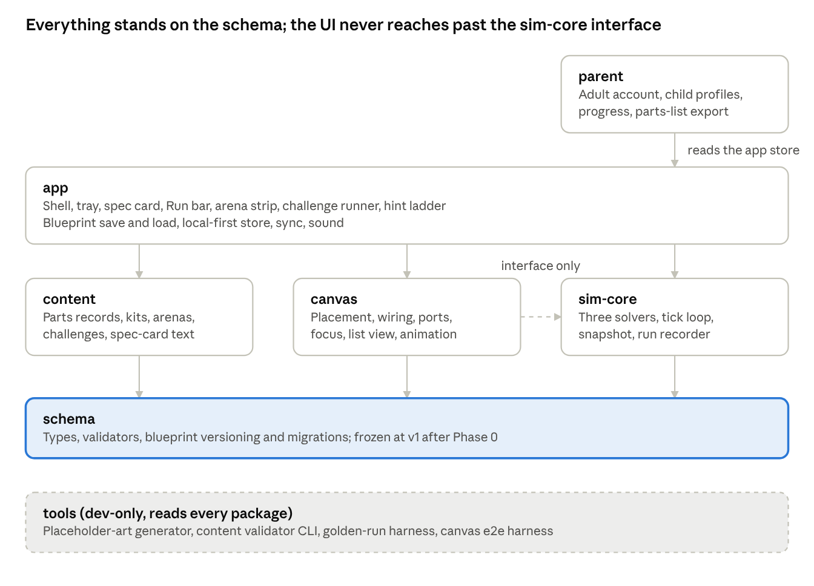
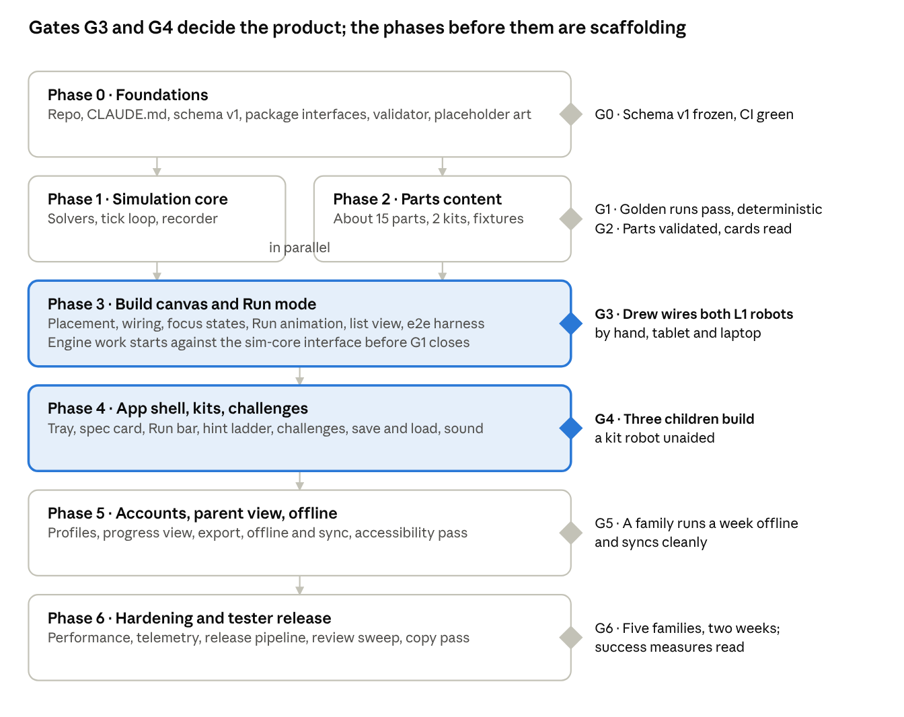

# Servo — Agentic Build Plan

As of 2026-09-29 · Drew Douglas · Source of truth: https://claude.ai/code/artifact/a21cd97b-54ec-45fe-b840-fb4bdda8d268 (this file is an export; refresh it when the doc changes). The executable decomposition of this plan lives in `.claude/plans/PLAN-servo.md` and `status.json`; package IDs there are `phase.task` (P0-1 → 0.1, gates → G0…G6).

This plan turns [Servo — Product & Design Brief](brief.md) into work an orchestrating agent can dispatch to worker agents session by session, with a gate at the end of every phase that a human (Drew) or a test suite closes.

## 1. How this plan runs

One orchestrating agent session owns the plan; it dispatches work packages to worker agents, checks their output against each package's acceptance test, and advances a status file. Drew closes phase gates. No agent decides scope, art direction or curriculum content on its own — those come from the brief or from Drew.

| Role | Who | Does | Does not |
| --- | --- | --- | --- |
| Owner | Drew | Closes phase gates, answers held decisions, runs child tests, reviews the canvas by hand | Write code or content records directly unless he chooses to |
| Orchestrator | One long-running agent session (Fable/Opus class) | Reads the brief and this plan, picks unblocked packages, writes worker briefs, verifies acceptance, updates the status file, raises questions to Drew | Implement packages itself beyond small glue |
| Builder worker | Fresh agent session per package (Sonnet class for scoped packages, Opus class for the simulation core and canvas engine) | Implements one package to its acceptance test, in a branch, with tests | Change interfaces owned by another package without an orchestrator note |
| Content worker | Fresh agent session per batch of parts or challenges | Writes parts records, spec-card text, challenge definitions against the schema; runs the content validator | Invent specs or terminology outside the brief |
| Reviewer worker | Fresh agent session | Adversarial review of a finished package: runs tests, reads diffs, checks against the ground rules | Fix things itself; it reports |

**What every agent reads first, in order:** the brief (Sections 4, 6, 9 and 10 at minimum), Section 2 of this plan, the repository's `CLAUDE.md` (written in Phase 0 from these two documents), the status file, and its own work-package row. Nothing else is assumed to be in context.

**Unit of work.** A work package is the smallest thing with a testable acceptance line. Packages are sized to finish in one worker session (roughly 1–3 hours of agent time). A package that cannot be stated with an acceptance test is not ready to dispatch.

**Gates.** Each phase ends with a gate: a checklist of acceptance tests that must pass plus, from Phase 3, a hands-on check by Drew and (Phases 4 and 6) a child test. The orchestrator may start the next phase's unblocked packages before a gate closes, but nothing from a later phase merges to main until the earlier gate is closed.

**Once a repository exists**, this plan is turned into an executable run brief with the `pharao` skill (task decomposition, model routing, `status.json`, `RUN.md`). Section 9 describes the files it expects.

## 2. Ground rules every agent follows

These rules are copied into the repository's `CLAUDE.md` in Phase 0 and every worker brief points at them. A package that breaks one is rejected at review even if its tests pass.

**Architecture**

1. Parts are data. No part's identity, ports, behaviour or failure mode is written into UI or engine code. Adding a part touches only the content package and its fixtures.
2. The simulation core is pure and deterministic: same blueprint plus same arena plus same seed gives the same run, tick for tick. It has no dependency on the UI, the DOM or the clock.
3. Wires join typed ports only; type rules live in one module the canvas and the engine both import.
4. Build mode edits a blueprint; Run mode consumes a snapshot and never writes back. Stop restores the snapshot exactly.
5. The blueprint is the only persisted build format, versioned from day one with a migration path.
6. Every package exposes an interface file (types plus a one-page README) before its implementation; other packages build against the interface.

**Product**

7. Real component names everywhere in code, content and UI. No character names, no mascot, no robot face, no points, coins, streaks or lives.
8. Every canvas action has a touch path, a pointer path and a list-view (screen reader) path, delivered together, not later.
9. Failure modes are simulated behaviour, never error dialogs. Text hints follow the hint ladder (pulse part → pulse port → ghost wire → do it for me).
10. Levels 1–2 are launch scope. Level 3+ features are built only when a package explicitly names them.

**Process**

11. One package per branch; a package merges only with its acceptance test green and a reviewer worker's report attached.
12. Placeholder art is vector, drawn from the part's schema colours and proportions, keyed through the swap registry. Agents never generate final art.
13. Anything not stated in the brief or this plan is a question for Drew, logged in the status file's `questions` list, not a guess. Workers pick the most conservative interpretation and flag it.
14. Definition of done for a package: interface unchanged or change noted; tests added and green; README updated; placeholder content validated; reviewer report filed; status file row set to `done`.

## 3. Repository and package layout

One monorepo, seven packages, and a strict dependency direction: content and the simulation core know nothing about the UI, and the UI never reaches past the engine's interface. This is what lets builder workers run in parallel without treading on each other.

Arrows point at what a package depends on. Content and sim-core share only the schema, so their workers run in parallel; canvas reaches sim-core through its interface alone.

| Package | Owns | Depends on | Worker tier |
| --- | --- | --- | --- |
| `schema` | Part, port, wire, blueprint and challenge type definitions; validators; blueprint versioning and migrations | nothing | Opus class (Phase 0), then frozen |
| `content` | Parts records, kits, challenges, spec-card text, arena presets; the content validator CLI | `schema` | Content workers, Sonnet class |
| `sim-core` | Electrical, program and mechanical solvers; tick loop; run recorder; deterministic seed | `schema` | Opus class |
| `canvas` | The build surface: rendering, placement, wiring, ports, focus states, zoom, list view; Run-mode animation driven by sim-core events | `schema`, `sim-core` (interface only) | Opus class for the engine, Sonnet class for features |
| `app` | Shell, navigation, header, tray, spec card, Run bar, arena strip, hint ladder, challenge runner, offline store, sync | `schema`, `content`, `sim-core`, `canvas` | Sonnet class |
| `parent` | Adult account, child profiles, progress view, parts-list export | `schema`, `app` store | Sonnet class |
| `tools` | Placeholder-art generator from schema, swap registry, content fixtures, e2e harness, golden-run tooling | all, dev-only | Sonnet class |

**Interfaces first.** Phase 0 writes the `schema` package and a one-page interface for each other package before any implementation, so every later worker has a contract to build against. The interfaces are versioned; a worker who needs an interface change files it as its own small package rather than editing in place.

**Stack decisions to make in Phase 0** (recommendations from the brief, to be confirmed by Drew): TypeScript throughout; a web-first app; a hardware-accelerated 2D canvas renderer for the build surface; a small 2D physics library for the arena; a local-first store with sync; component tests plus an e2e harness driving the real canvas.

## 4. Phase plan

Seven phases, each closed by a gate. Phases 1 and 2 run in parallel (the simulation core and the parts content only share the schema), and Phase 3's canvas engine can start against the sim-core interface before Phase 1 closes. Durations are agent-time estimates for planning, not commitments.

Each diamond is the gate that closes its phase; the highlighted phases end in hands-on gates that only Drew or a child can pass. Phases are ordered, not to scale.

The gates that matter most are G3 and G4: the first time Drew wires a build by hand on a tablet, and the first time a child does. Everything before them is scaffolding that can be rebuilt cheaply; everything after them depends on the wiring feeling right.

## 5. Work packages — Phases 0–2

Each row is one worker session. `Depends on` lists package IDs that must be `done` first; a row with none is dispatchable as soon as its phase opens. Acceptance lines are what the orchestrator checks before marking `done`.

**Phase 0 · Foundations** (gate G0: schema frozen at v1, interfaces published, CI green on an empty app)

| ID | Package | Deliverable | Depends on | Acceptance |
| --- | --- | --- | --- | --- |
| P0-1 | repo | Monorepo scaffold, package folders, lint, test runner, CI, `CLAUDE.md` written from the brief and Section 2 | — | CI runs an empty test in every package; `CLAUDE.md` quotes all 14 ground rules |
| P0-2 | schema | Part, port, wire, mount, blueprint, arena, challenge and run-record types with validators | P0-1 | Fixture blueprints (valid and 10 invalid) validate as expected |
| P0-3 | schema | Blueprint versioning and migration runner | P0-2 | A v0 fixture migrates to v1 and round-trips |
| P0-4 | all | One-page interface README per package (`sim-core`, `canvas`, `app`, `content`, `parent`, `tools`) | P0-2 | Each README names its public functions, events and owning package; orchestrator sign-off |
| P0-5 | tools | Content validator CLI: checks a parts record against the schema and the terminology list | P0-2 | Rejects a record with a character name or a missing port type |
| P0-6 | tools | Placeholder-art generator: a vector tile per part from its schema colours and proportions, keyed in the swap registry | P0-2 | Runs over fixtures and emits one SVG per part; registry resolves keys |

**Phase 1 · Simulation core** (gate G1: golden runs pass for every Level 1–2 fixture; determinism proven)

| ID | Package | Deliverable | Depends on | Acceptance |
| --- | --- | --- | --- | --- |
| P1-1 | sim-core | Graph builder: blueprint → wired graph with power nets, signal links and mechanical mounts | P0-2 | Nets and links match hand-drawn expectations for 8 fixture builds |
| P1-2 | sim-core | Electrical solver: lumped model, battery capacity and drain, per-net voltage, short detection | P1-1 | A motor on a 1-cell vs 2-cell pack shows the specified speed ratio; a short drains in the specified time |
| P1-3 | sim-core | Behaviour runtime: reads each part's behaviour rule from content and steps it per tick | P1-1, P2-1 | DC motor, LED, buzzer, switch and servo behave per their records, including failure modes |
| P1-4 | sim-core | Mechanical solver: differential drive, 2.5D arena, collisions with props, tipping by centre of mass | P1-3 | A two-motor robot drives straight, turns when one motor reverses, and tips with a top-heavy fixture |
| P1-5 | sim-core | Tick loop, clock speed (1–30 tps), snapshot and restore, run recorder | P1-2, P1-4 | Same seed produces identical run records across 100 runs; Stop restores the snapshot byte-for-byte |
| P1-6 | sim-core | Program runtime stub: block-rule interface and a no-op brain, so Level 3 slots in later | P1-3 | Interface documented; a fixture with a brain runs without error |
| P1-7 | tools | Golden-run harness: records reference runs per fixture and diffs future runs | P1-5 | Any solver change that alters a golden run fails CI with a readable diff |

**Phase 2 · Parts content, Levels 1–2** (gate G2: about 15 parts and 2 kits validated; Drew has read every spec card)

| ID | Package | Deliverable | Depends on | Acceptance |
| --- | --- | --- | --- | --- |
| P2-1 | content | Level 1 parts records (battery pack, switch, DC motor, wheel, caster, frame/chassis, LED) with ports, needs, behaviour, failure modes, spec-card layers 1–2 | P0-5 | Validator passes; every part has at least two failure modes with a teaching note |
| P2-2 | content | Level 2 parts records (motor driver, buzzer, 2nd battery option, gearbox, bumper switch, second wheel size, servo motor preview) | P2-1 | Validator passes; spec-card layers 1–2 plus popular-mechanics line on every part |
| P2-3 | content | Kits: "Rolling Start" (L1) and "Circuit Crew" (L2, name to confirm) with tray grouping by family | P2-2 | Each kit builds at least one working fixture robot |
| P2-4 | content | Arena presets: open floor, wall stop, ramp, bump props | P0-2 | Each preset loads and validates |
| P2-5 | content | Terminology list and banned-words list as data used by the validator and later by the UI | P0-5 | Validator fails a record using a banned word |
| P2-6 | content | Fixture blueprints: 8 working, 8 broken (one fault each) across L1–2 for the sim and canvas teams | P2-2 | Each broken fixture's fault is named in its metadata and reproduces in sim-core |

## 6. Work packages — Phases 3–4

**Phase 3 · Build canvas and Run mode** (gate G3: Drew wires the two Level 1 kit robots by hand on a tablet and a laptop; both run; list view drives the same build)

| ID | Package | Deliverable | Depends on | Acceptance |
| --- | --- | --- | --- | --- |
| P3-1 | canvas | Renderer and scene graph: layers as the brief orders them, pan, zoom, fit, grid that fades at rest; 60 fps on a 2020 iPad with 25 parts | P0-4, P0-6 | Frame-time budget met on the fixture builds; layers verified by screenshot tests |
| P3-2 | canvas | Part placement: drag from tray, tap-then-tap, snap to mounts within 48 px, slide to nearest free spot, move, rotate, remove | P3-1 | E2E scripts for touch and pointer paths pass on all fixtures |
| P3-3 | canvas | Wiring: port sockets, drag-to-wire, colour-typed acceptance, glow on approach, push-away on wrong type, snap-back on cancel, 24 px hit areas, re-route on move | P3-2 | Every legal fixture can be wired by script in both input paths; illegal wires are refused with the glow cue |
| P3-4 | canvas | Selection and focus: dim-unconnected, wire highlight with flow labels, spec-card open event | P3-3 | Screenshot tests for each focus state |
| P3-5 | canvas | Run-mode animation: consumes sim-core run events; animated dots on wires, wheel spin, servo sweep, LED, buzzer visual twin, stall shudder, tip | P3-3, P1-5 | Each failure mode in the broken fixtures is visibly distinct in a recorded run |
| P3-6 | canvas | List view (screen-reader path): structured parts-and-wires list with the same actions as the canvas | P3-3 | A fixture built entirely from the list view is byte-identical to the same build wired on canvas |
| P3-7 | canvas | Tidy-wires router and zoom limits | P3-3 | Routed wires never cross a part body on the 25-part fixture |
| P3-8 | tools | Canvas e2e harness with touch emulation, screenshot diffing and input-path parity checks | P3-1 | Runs in CI in under 10 minutes |

**Phase 4 · App shell, kits and challenges** (gate G4: three children aged 6–8 each build a Level 1 kit robot with no adult help beyond reading; hint ladder used, never bypassed)

| ID | Package | Deliverable | Depends on | Acceptance |
| --- | --- | --- | --- | --- |
| P4-1 | app | Shell and layout: header, tray (left / bottom in portrait), spec card (right, slide-in), Run bar, arena strip; every edge tuckable; canvas never under 70% | P3-1 | Layout tests at 10-inch, 13-inch and portrait; tuck states persist |
| P4-2 | app | Part tray from a kit, grouped by family, with the Library button (browse-only before Level 3) | P2-3, P4-1 | Tray shows exactly the kit's parts; library opens as an overlay with family and domain filters |
| P4-3 | app | Spec card: layered text by level, ports, needs/gives, settings dials (child-sized steps with real units), live readouts in Run, speak-it button | P2-2, P4-1 | Every Level 1–2 part renders its card at Levels 1 and 2 without truncation; readouts match run records |
| P4-4 | app | Run bar and clock: Run/Stop, slow-motion 1–30 tps, Undo, Reset arena, one-second spin-up | P3-5, P4-1 | Stop restores the build; slow-motion shows per-tick steps with the tick sound's visual twin |
| P4-5 | app | Challenge runner: goal line, arena preset, goal detection from run records, tick on success | P2-4, P4-4 | All Level 1–2 challenge fixtures detect success and non-success correctly |
| P4-6 | app | Hint ladder: pulse part → pulse port → ghost wire → do it for me; triggers after two missed Runs or on request | P4-5 | Each step renders on canvas without covering a port; "do it for me" produces a valid wire |
| P4-7 | content | Level 1 challenges: 5 part introductions, 5 guided, 2 breakdowns, 2 what-ifs, 1 unscripted build | P2-6, P4-5 | Each challenge has a passing fixture and at least one failing fixture |
| P4-8 | content | Level 2 challenges: same shape, 6 guided | P4-7 | As above |
| P4-9 | app | Blueprint save, load, duplicate, name; local-first store | P0-3 | Round-trip of all fixtures; migration runs on load |
| P4-10 | app | Sound layer: click, whir, hum by speed, buzz, knock, tick; each with a visual twin; mute persists | P4-4 | Audio events map one-to-one to run events in a recorded run |

## 7. Work packages — Phases 5–6

**Phase 5 · Accounts, parent view, offline** (gate G5: a family with two child profiles uses Servo offline for a week and syncs cleanly; parent view matches the run records)

| ID | Package | Deliverable | Depends on | Acceptance |
| --- | --- | --- | --- | --- |
| P5-1 | parent | Adult account and child profiles (no child email, no chat, no public sharing) | P4-9 | Profile switch keeps builds separate; no route exposes another child's data |
| P5-2 | parent | Progress view: parts met, unscripted builds passed, faults fixed, time in sandbox | P5-1, P4-5 | Figures reconcile to run records for all fixtures |
| P5-3 | parent | Parts-list export per blueprint (printable, with real names and a wiring summary) | P5-1 | Export of each kit fixture lists every part once with its family |
| P5-4 | parent | Two-minute "name the part" card game for the adult-led Level 2 check | P5-2 | Draws from Level 1–2 parts only; records a result per child |
| P5-5 | app | Offline: full sandbox and downloaded levels without network; sync on reconnect with conflict rule (latest blueprint wins, both kept) | P4-9 | Airplane-mode e2e passes; conflict fixture keeps both versions |
| P5-6 | app | Sharing: adult-to-adult blueprint links, read-only | P5-1 | Link opens the build in replay without exposing profile data |
| P5-7 | app | Accessibility pass: WCAG 2.2 AA on chrome; line styles and port shapes as colour twins; high-contrast theme; dyslexia-friendly type; left-handed mirror | P4-1 | Automated a11y checks green; manual checklist signed by Drew |

**Phase 6 · Hardening and tester release** (gate G6: five homeschool families run Levels 1–2 for two weeks; the success measures in the brief's Section 14 are read for the first time)

| ID | Package | Deliverable | Depends on | Acceptance |
| --- | --- | --- | --- | --- |
| P6-1 | app | Performance: 25-part builds at 60 fps on a 2020 iPad and a low-end Chromebook; cold start under 3 s | P4-1 | Measured in CI on device farm or recorded manually |
| P6-2 | app | Telemetry for the success measures only: run records, session start mode, hint use, export events; documented in the parent view's one-screen data note | P5-2 | Every event listed in the note; nothing else emitted |
| P6-3 | tools | Release pipeline: web build, versioned content bundle, tester invite codes | P0-1 | A tagged commit produces a tester URL with a content version shown in Settings |
| P6-4 | all | Reviewer sweep: every package re-reviewed against the 14 ground rules; open findings fixed or logged | all | Reviewer reports filed; no rule-7 or rule-8 findings open |
| P6-5 | content | Copy pass on every spec card and hint against the voice rules (Section 12 of the brief) | P4-8 | Drew signs off each card |
| P6-6 | app | Level 3 slot: program view placeholder behind a flag, servo settings unlocked, so the next phase has a door | P1-6 | Flag off by default; on, a servo angle can be set and runs |

**After G6.** Tablet store wrappers, Level 3 (brain, sensors, block rules), the classroom layer and the hardware bridge are planned as separate follow-on plans once the measures from the tester release are in hand.

## 8. Testing and acceptance

The test strategy leans on the fact that the simulation is deterministic and the parts are data: most of Servo's correctness can be proven without a screen, and the screen is then checked for parity with the list view.

| Layer | What it proves | Tooling | Runs |
| --- | --- | --- | --- |
| Schema fixtures | Valid and invalid blueprints, parts and challenges are accepted or refused correctly | Validator unit tests | Every commit |
| Part behaviour fixtures | Each part's behaviour and every failure mode, in isolation on a minimal circuit | sim-core unit tests generated from the content records | Every commit |
| Golden runs | Whole-build simulation is unchanged unless intended | Run recorder diff against stored references | Every commit; a diff needs an orchestrator note to accept |
| Determinism | Same inputs, same run | 100-run repeat per fixture | Nightly |
| Input-path parity | Touch, pointer and list view produce identical blueprints | Canvas e2e harness | Every canvas or app commit |
| Screenshot diffs | Layers, focus states, layout at three screen sizes, hint rendering | Canvas e2e harness | Every canvas or app commit |
| Performance | Frame time and cold start on reference devices | Device runs, recorded | Weekly from Phase 3 |
| Content lint | Terminology, banned words, spec-card layer completeness | Content validator CLI | Every content commit |
| Accessibility | WCAG checks on chrome; colour-twin presence | Automated a11y suite plus manual checklist | Phase 5 and every release |
| Hands-on gate | The build feels right to an adult | Drew, on tablet and laptop | G3, G5, G6 |
| Child test gate | A child can do it | Three children (G4), five families (G6), observed, no coaching | G4, G6 |

**Child tests are the only gates agents cannot close.** The orchestrator prepares them (builds, devices, an observation sheet listing what to watch: first wire attempt, hint use, response to a failure state) and Drew runs them. Findings become new packages, never patches to a merged one.

## 9. Session protocol

Agents lose context between sessions; the repository keeps it. Five files carry the plan's state and every session starts by reading them in order.

| File | Holds | Written by |
| --- | --- | --- |
| `CLAUDE.md` | The 14 ground rules, the reading order, the package map, how to run tests | Phase 0, then the orchestrator only |
| `docs/brief.md` and `docs/plan.md` | Exports of the two Claude docs, refreshed when Drew changes them | Orchestrator, at the start of each orchestrator session |
| `.claude/plans/status.json` | One row per package: id, phase, state (`todo`, `in_progress`, `review`, `done`, `blocked`), branch, worker session, acceptance result, reviewer report path | Orchestrator; workers only flip their own row to `review` |
| `.claude/plans/questions.md` | Numbered questions for Drew with the package that raised each and the conservative interpretation the worker used | Any agent appends; Drew answers inline; orchestrator folds answers into `CLAUDE.md` or a package |
| `.claude/plans/RUN.md` | The orchestrator's run brief: current phase, open gate checklist, dispatch order, model routing | Generated from this plan with the `pharao` skill, then maintained |

Implementation note (2026-09-30): the pharao skill's own state engine replaces the hand-maintained columns above — `status.json` uses pharao's statuses (`pending`, `dispatched`, `done`, `failed`, `parked`) and its `decision_queue` stands in for `questions.md`; the run brief is `RUN-servo.md`. All state changes go through `python3 .claude/plans/pharao.py`.

**An orchestrator session.** Refresh the docs exports → read `status.json` and `questions.md` → verify any package in `review` (run its acceptance line, read the reviewer report, merge or send back) → pick the unblocked packages in the current and next phase → write one worker brief per package (the package row, the interface it touches, the acceptance line, the ground rules, the files it may edit) → dispatch → update `status.json` → stop when the gate checklist is complete or a question blocks the phase.

**A worker session.** Read the five files and its brief → restate the acceptance line in its own words in the PR description → implement on its branch → run the package's tests and the content validator → flip its row to `review` → stop. A worker that needs an interface change or hits a brief gap writes to `questions.md` and stops rather than guessing.

**Handoffs.** Nothing is handed between sessions in chat. If a fact matters, it is in a file above or in a test.

**Model routing.** Fable or Opus class for the orchestrator, `schema`, `sim-core` and the canvas engine packages (P3-1 to P3-3); Sonnet class for feature, content and tooling packages; reviewer workers on the Opus class for Phases 1 and 3, Sonnet class elsewhere. Routing is a column in `status.json` so it can change per package.

## 10. Decisions held for Drew and agentic-build risks

Phase 0 cannot start cleanly until the first four decisions are made; the rest can wait for the phase that needs them. See also [decisions.md](decisions.md).

| # | Decision | Needed by | Default if unanswered |
| --- | --- | --- | --- |
| 1 | Confirm the reframe (parts over story) and the extended age ladder with Levels 1–2 as launch scope | Phase 0 | As written in the brief |
| 2 | Stack: TypeScript web-first app, 2D canvas renderer, 2D physics library, local-first store | Phase 0 | Orchestrator proposes concrete libraries in P0-1 and waits |
| 3 | Repository host and CI (GitHub recommended, so reviewer workers and `gh` tooling work) | Phase 0 | GitHub, private |
| 4 | Name the eleventh part family and confirm the Level 1–2 parts lists in P2-1 and P2-2 | Phase 2 | Ten families; lists as written |
| 5 | Kit names ("Rolling Start", "Circuit Crew") | Phase 2 | Placeholders kept |
| 6 | Part render style and background treatment for final art | Phase 6 or later | Vector placeholders ship to testers |
| 7 | Tester families and devices for G4 and G6 | Phase 4 | Orchestrator drafts the observation sheet; Drew recruits |
| 8 | Monetisation and whether a classroom layer follows G6 | After G6 | Nothing built |

**Risks specific to building this way**

| Risk | Mitigation in this plan |
| --- | --- |
| Workers drift from the brief's taste (a mascot creeps in, a modal tutorial appears) | Ground rules 7–9 are lint-able where possible (banned words, no dialog components) and checked by reviewer workers on every package |
| Interface churn between parallel workers | Interfaces published in Phase 0 and changed only through their own small packages |
| Simulation "works" but teaches nothing | Part behaviour fixtures are written from the content records' failure notes, so each teaching claim has a test |
| Agents close gates they should not | Child-test gates are Drew-only by rule; the orchestrator can only prepare them |
| Context loss between sessions | Everything lives in the five files of Section 9; chat carries nothing |
| Cost runs ahead of value | Phases 0–2 are cheap and mostly Sonnet-class; the expensive canvas work starts only against a proven simulation |
