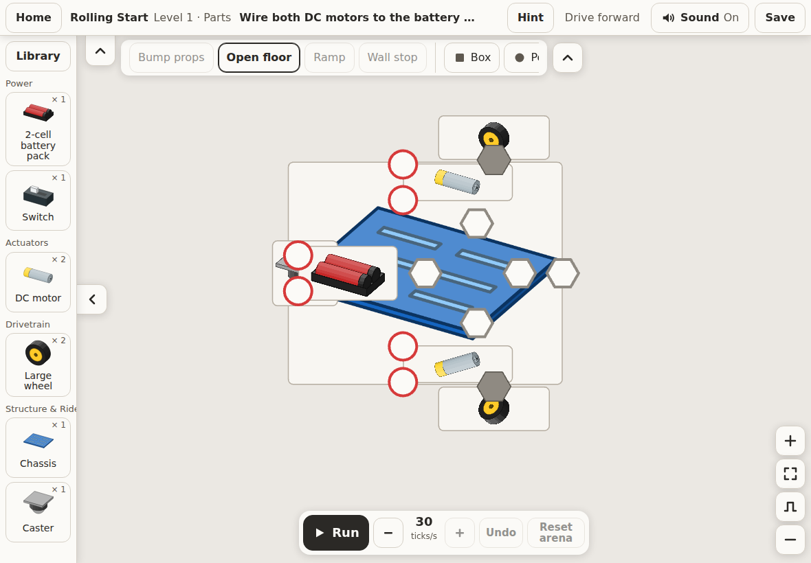
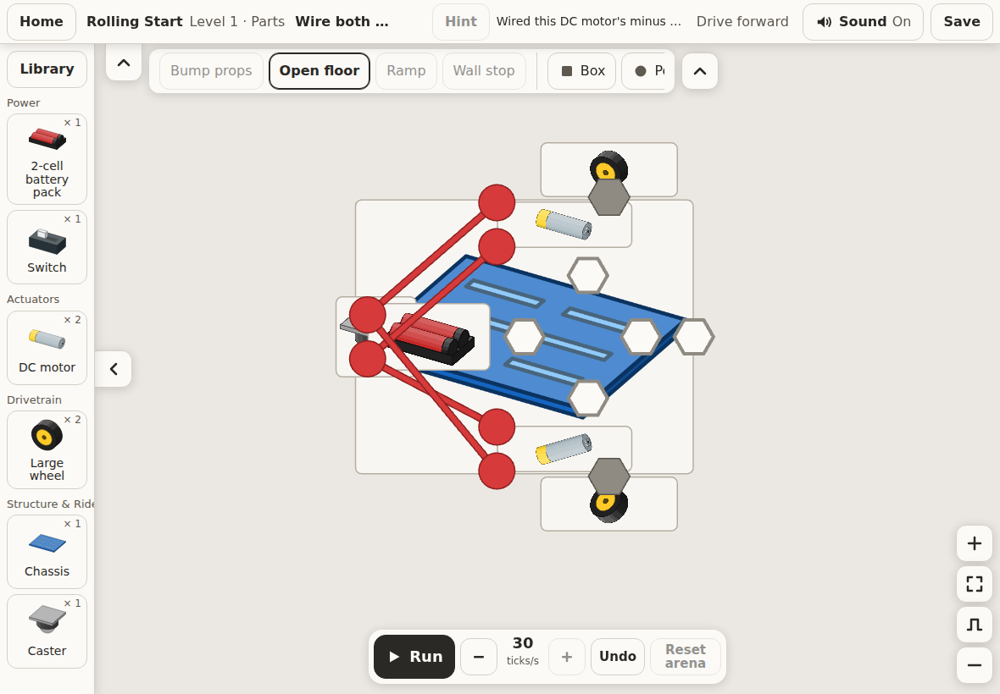
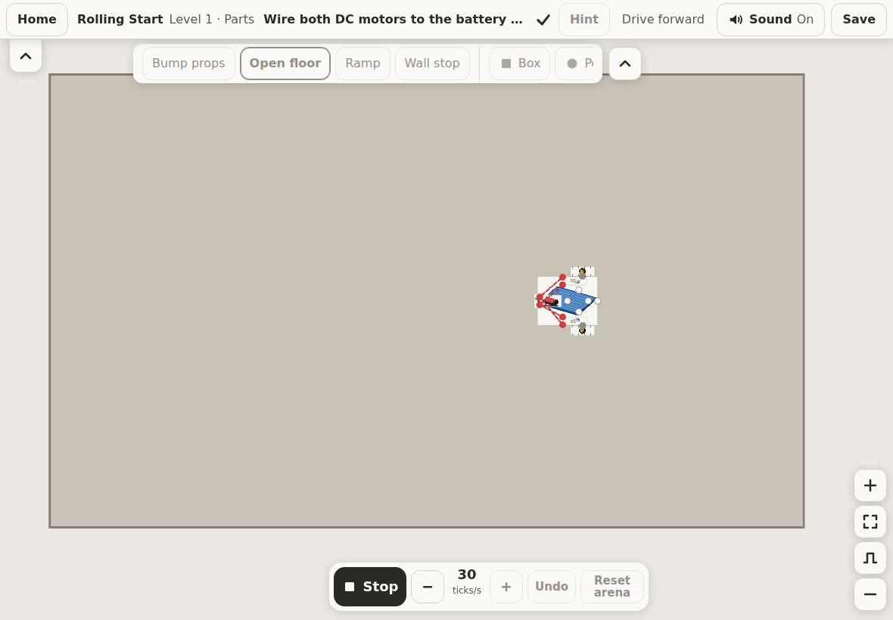
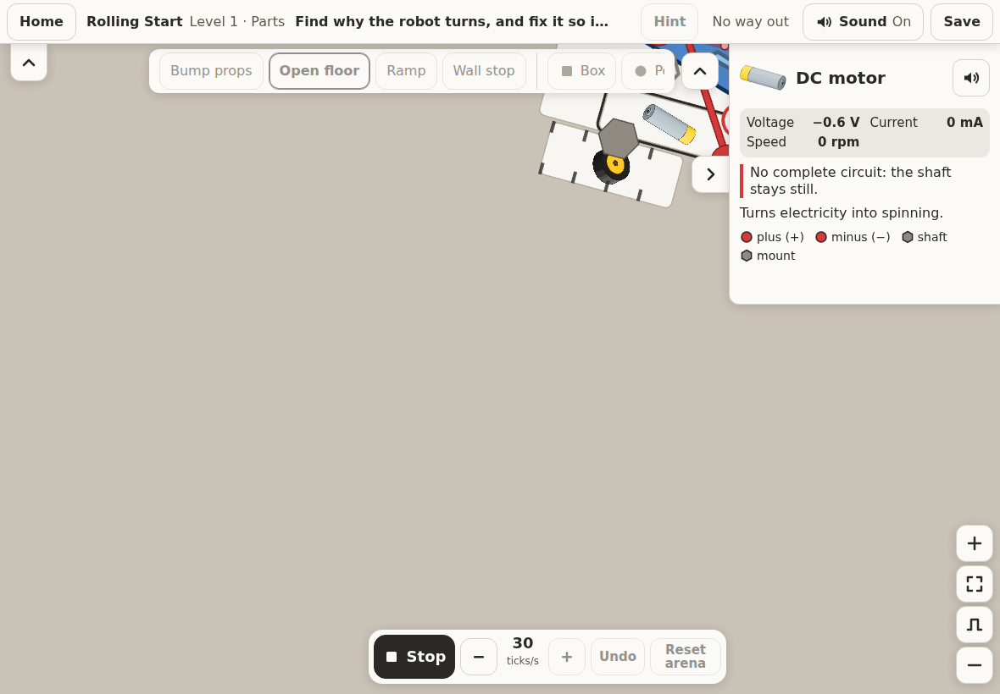

# True north

As of 2026-10-04. Written for Drew after a session that built the app, opened it in a browser and drove it by script. The product and build docs are unchanged; this page says where the build stands against them and what to do next.

## The one thing Servo is

**A sandbox of robot parts where a child wires real components together and sees what happens** (brief Section 1). The whole product is one loop a child runs in under a minute:

> pick parts → place them on the canvas → wire them → press Run → watch what happens → fix or change something → Run again

Everything else in the repository exists to feed that loop or read out of it. When a decision, a task or a finding does not touch the loop, it can wait.

## Where the build stands

Fifty-nine of sixty-three plan tasks are done, every package has a reviewer report, and no person has ever run the app. Gates G2 to G5 are closed "provisionally", which means the hands-on sessions have not happened. The app was built blind, so the first thing this session did was open it and run the loop.

The loop works end to end in a browser, on the production build. The pictures below are real screenshots from that run (1180 × 820, the iPad landscape profile).

| Step | What happened |
| --- | --- |
| Open the app | An empty sandbox build, the Rolling Start tray on the left, Run off with "Place a part first." |
| Home | Saved builds and every Level 1 and 2 challenge by level |
| Drive forward | The challenge's start build loads with its goal line and the hint button |
| Hint ladder | Pulse part, pulse port, ghost wire, do it for me, four ladders, all four motors' wires landed |
| Run | The wires light, the robot drives, the goal's check mark appears |
| Stop | The build comes back exactly as it was |
| No way out (breakdown) | Tapping the DC motor shows its card; in Run the card reads "No complete circuit: the shaft stays still." with live volts and rpm |
| Sandbox | A battery pack dragged from the tray lands on the canvas; the chassis placed by tap-then-tap shows its mount rings |









## What was breaking the loop, now fixed

1. **Run lost the robot.** The view did not move when Run started, so the robot drove out of the Build view in under two seconds and the child watched an empty floor. The canvas docs always said the app should call `fit` on Run to show the arena; the app never did. Now the shell frames the arena on Run and the build again on Stop. This is the only change in this session that touches the loop itself.
2. **Home listed a level backwards.** Challenges came alphabetically by id, so "Cross the arena", the unscripted build that closes Level 1, was first, and "Meet the battery pack" was third. Home now lists each level in the brief's order: part introductions, guided challenges, breakdowns, what-ifs, the unscripted build.
3. A missing favicon put a red 404 in every tester's console. A plain socket ring now stands in.

The app's own suite was run against these changes: 541 unit tests and 178 browser tests pass. One browser test fails before and after the change, in the Level 3 slot (`program-view.test.tsx`, "only the angle unlocks"), which is behind a flag and outside launch scope; it is noted, not fixed here.

## What only Drew can do

Nothing in the plan moves the product further until a person wires a robot by hand. The two gates that decide the product, G3 (Drew on an iPad and a laptop) and G4 (three children), are prepared and waiting:

```
pnpm install
pnpm release:dry
pnpm release:preview
```

Open the printed address on the iPad over the same Wi-Fi, and follow [gates/G3-howto.md](gates/G3-howto.md) for the two Level 1 robots, then [gates/G4.md](gates/G4.md) for the children. Needs Node 24 and pnpm 12. Whatever feels wrong on the tablet becomes a task; nothing else should be built before then.

## How the plan got convoluted, and what to do about it

Three things made the plan feel bigger than the product:

- **113 open decisions.** Every reviewer question was queued for Drew with a default, and the build proceeded on the default. Nearly all of them are already settled in practice. They sort into three piles:
  - **Hands-on sign-offs (6):** D64 (read the spec cards), D95 (G3), D111 (G4), D113 (accessibility checklist), D114 (G5), D112 (copy pass). These are the sessions above, not questions.
  - **Direction and business (8):** D1 (the reframe, already built as written), D6 (final art style), D7 (tester families), D8 (money and classroom), D13 (sync host, nothing syncs until it is chosen), D103 (CI required check), D107 (GitHub billing has stopped CI since 2026-10-03), D115 (Run frame time on a low-end Chromebook).
  - **Everything else (about 100):** engineering defaults that are now in the code, the docs and the tests. They can be resolved in bulk as "default stands". Reopening one later is a task like any other.
- **A seventh wave of tasks (7.4 to 7.8)** came out of the reviewer sweep. They are test-coverage work (three input paths for every control, e2e parity for every edit kind, parent-view paths). None of them changes what a child sees. They should wait behind G3 and G4, which will produce the tasks that matter.
- **Process weight.** Worktrees, per-task reviews, golden runs and determinism sweeps were the right scaffolding for building blind, and they did their job: the loop works first time. From here the cheaper signal is a person on a tablet.

Recommended order from here: run G3 → file what felt wrong as tasks → fix those → run G4 → then decide whether the 7.x wave is still worth doing.
